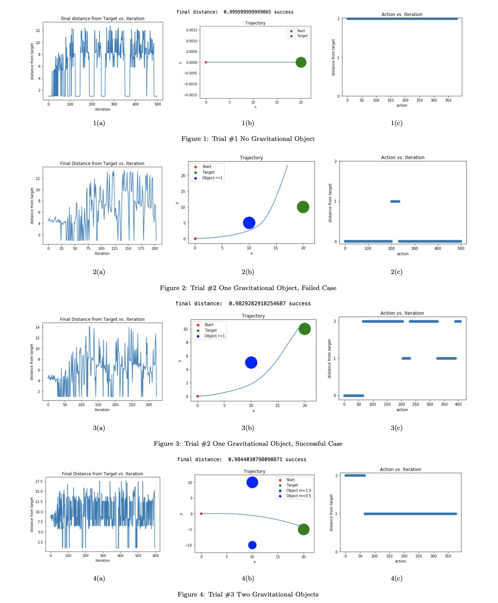
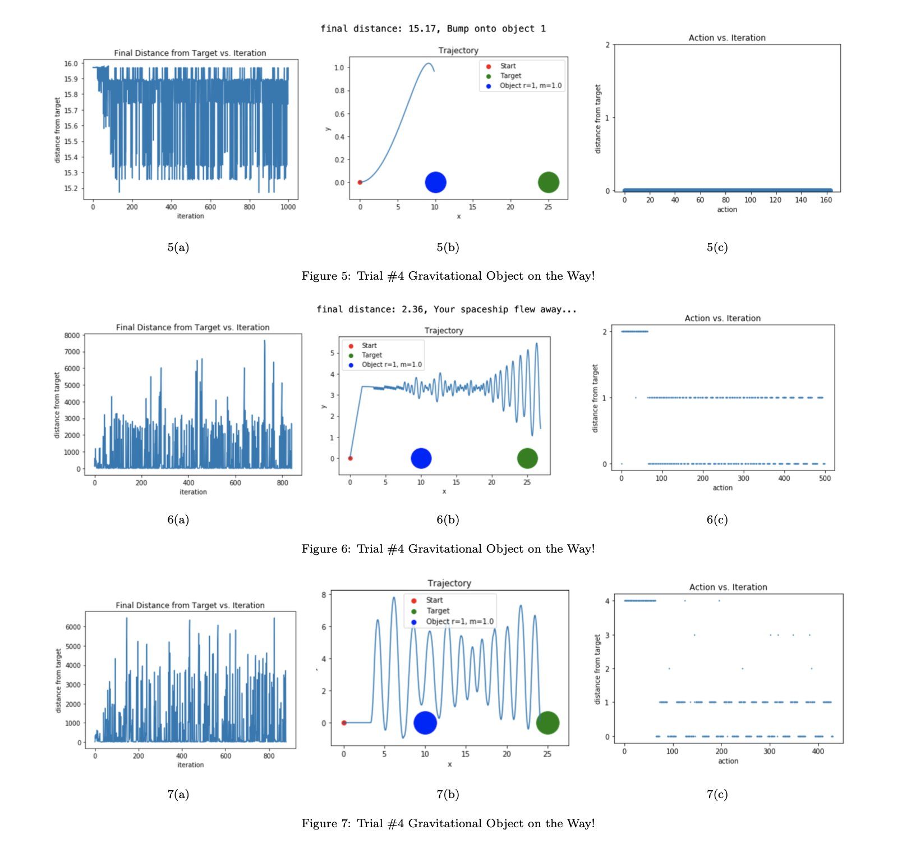

# Introduction
In this project, I’m trying to develop an algorithm that enables a spaceship to most efficiently travel through a gravitational field. Suppose our spaceship starts from a point A and wants to travel to point B. It is known that gravitational objects like stars or planets reside in the space between A and B, but we are not exactly sure about their status or it is too complex to analyze their motions, i.e., we don’t have a well-defined model. Therefore, it may be an interesting problem to design a model-free algorithm that enables the spaceship to autonomously decide its actions based on the feedback from the environment, i.e. forces experienced by the spaceship, and its status, ie. its relative location to B, velocity, and acceleration etc. The project tries to solve this problem based on Q-Learning, a model-free reinforcement learning algorithm, which will be described more in details in the next section. For the sake of simplifying the problem, I assume a 2D space and use point estimates for the spaceship and other gravitational objects, so I ignore all the angular motions. Further, I assume that the spaceship can only accelerate in y-directions and that the magnitude of acceleration is constant, so there are only two plausible actions for the spaceship. I also have not considered the usage of fuel, i.e., the spaceship can make infinite propulsions.

# Background
## Reinforcement learning and Q-Learning
I cannot find a focused paper on Q-Learning, so I referred to [this blog post](https://lilianweng.github.io/lil-log/2018/02/19/a-long-peek-into-reinforcement-learning.html#q-learning-off-policy-td-control) for the background information.

Reinforcement learning (RL) is an area of machine learning that explores how an agent should interact with its environment in order to maximize some notion of total reward. The goal of an RL algorithm is typically to learn a policy π(state) (a function that determines what action(s) to take in a given state) such that the total (expected) future reward

is maximized, where R_t is the reward at step t, and γ is a discount factor, `0 <= γ <= 1`.

To solve the problem, it is helpful to introduce the q function, `q : S × A → R` which gives the expected reward from taking an action a in a state s:

We can show that the q function satisfies

where the next state s' is deterministic given the current state s and the action a. This gives us an iteration method to find the optimal q* functions, 

where α is the learning rate.

After deriving the approximatoin of the q function, we can approximate the optimum policy as

Finally, since the obervation space is usally very large (continuous values for physics), we need to discretize the observation space. Also, we keep some randomness for model to further explore the space without using the policy given above. This is decided by a parameter ε. With a probability 1-ε, the model randomly selects an action instead of utilizing the policy and q functions.

## Problem Formulation

Assume we start from the origin A, and the target is B, which is on the x-axis. We define the following variables for the symbol:

- The set of states S, (rx, ry, vx, vy)

- The set of actions `A = {[0,Δv],[0,-Δv],[0,0]}`, which respectively represents 
  1) add a constant value to vy (accelerate in the y direction);
  2) substract a constant value from vy (decelerate in the y direction);
  3) no acceleration.

- The transition function, based on previous state s_t, use N-body solver to calculate the accelerations and evolve all positions and velocities to derive st+1.

- The reward funciton, 

   

  where `C = 1/||A - B||`2, which measures how well does the current step perform comparing to the previous state, i.e. whether the action brings the spaceship closer to B.

# Implementation
To implement the algorithm, I utilize object-oriented programming feature of Python. I created two classes, `SpaceTraversal` and `QLSolver`. `SpaceTraversal` encapsulates functions that enable the system to evolve for one step and returns the system's current status. The implementation is based on the N-body solver we did for problem set #5. `QLSolver` implements the Q-Learning algorithm given a `SpaceTraversal` object which is treated as the environment.

# Results
#### Note: for all trials, I initiate the spaceship with a initial leftward velocity. The possible actions for the spaceship is to accelerate upward (encoded as 0), accelerate downward (encoded as 1), and do nothing (encoded as 2).

## Trial #1 No Gravitational Objects
This is a sanity check that the algorithm does work. The spaceship has a initial leftward velocity, and the target is right on the left of the starting point, so the best thing the model can do is to do nonthing and the  From Figure 1(a), we can see that the model fails many times during the training. Fugure1(b) shows that the spaceship successfully arrives at the target, and Figure1(c) shows that the model indeed chooses to do nothing (action 2) thoughout the travel.

## Trial #2 One Gravitational Object
With one gravitational object, the training is harder. Figure 2 shows a failing case. We can see from Figure 2(c) that the spaceship accelerates upward since the target but is above it, but the gravitational field ultimately deflects the spaceship and it passes the target. Figure 3 shows a successful case, and Figure 3(c) shows that the model gets "smarter" now by staying still or even accelerates downward from time to time to counter the effects of the gravitational field.

## Trial #3 Two Gravitational Objects
In this trial, I test the case of two gravitational objects in the space. (Figure 4) It is interesting to note that the final actions of the model is actually very regular even though the model has the ccapacity to perform highly variant actions: it accelerates upward continuously for some time and then downward. This may illustrate the Occam's Razor Principle.

 

## Trial #4 Gravitational Object on the Way!
In this trial, I test a much harder scenario: I place a planet in between the target and the starting point. It turns out the task is actually quite impossible to complete. Even though the spaceship continuously accelerates upward (Figure 5(c)), it still bumps into the planet (Figure 5(b), the size of the planet is not to scale, please see the y-axis).

I then introduces a much more "powerful" spaceship with 1000× magnitude of acceleration. Things get more interesting as the spaceship passes the planet, but it's overly powerful such that the acceleration cannot be fine-tuned to arrive at the target (Figure6).

Finally, I gives the spaceship more "degrees of freedom" by embedding two more actions: accelerate upward or downward with smaller magnitude. So now the action encoding is:
  - 0 = accelerate upward with large magnitude
  - 1 = accelerate downward with large magnitude
  - 2 = accelerate upwward with small magnitude
  - 3 = accelerate downward with small magnitude
  - 4 = no action
The spaceship finally achives the target (Figure 7).

 

# Discussion and Further Work
I think this project is intersting in many ways. Certianly human beings would not be able to travel with spaceship through long distance in the near future, the algorihtm may be applied to other robotic systems like autonomous vehicles. (They are of course using much more sophisticated and accurate techniques.)
As I claimed in the introduction, I make several limited assumptions and put several limits on the spaceship. It's possible to break those limits with some further work including:

1. Extend 2D stimulation to 3D;
2. Enable the spaceship to complete more complicated actions such as the ability to accelerate in more directions;
3. Take into account the use of fuel, for example penalizing the model if it makes too many accelerations;
4. Take into account the angular motion. 